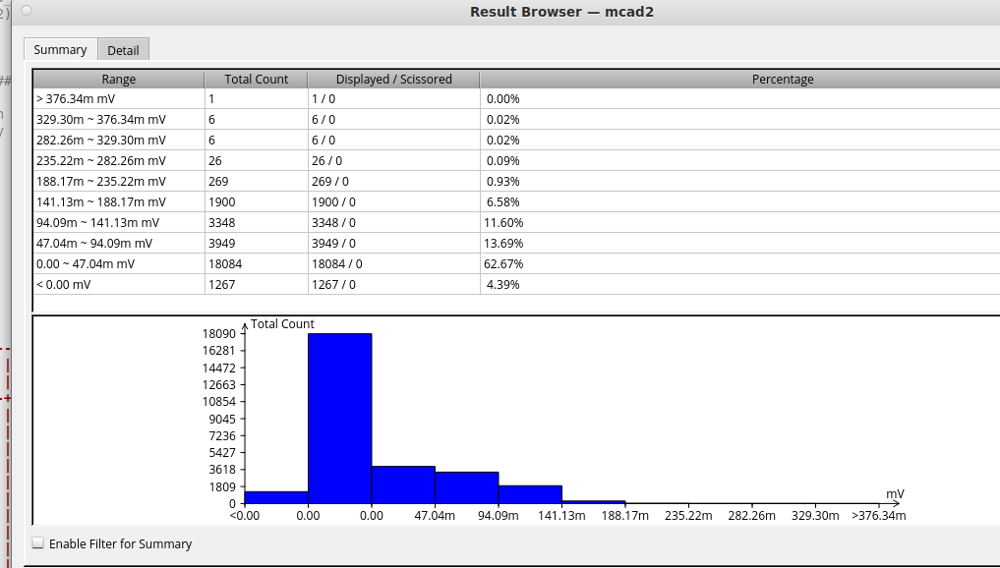
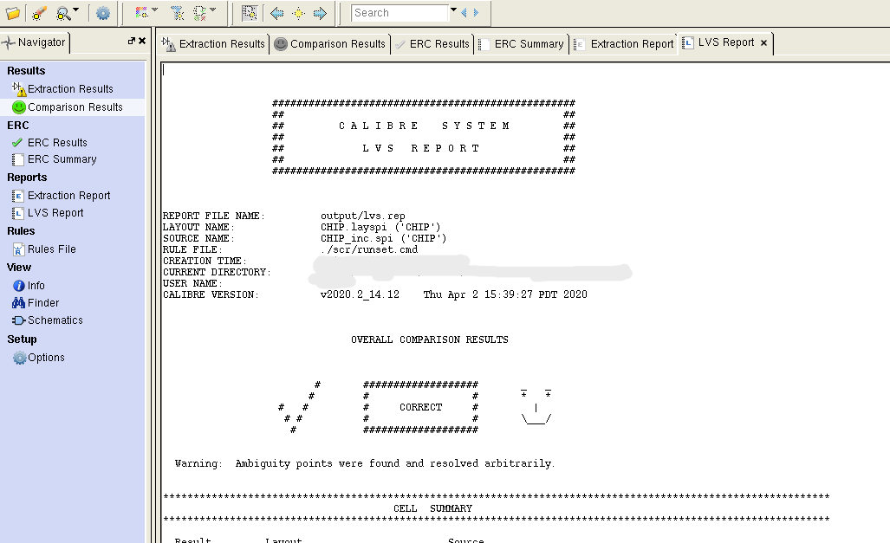

# Final Lab  Floating Point Number Multiplier

> 從RTL到DRC/LVS完整流程
> 
- 題目敘述
    - 設計一個IEEE 754 倍精度乘法器
- 要求
    1. design a pipeline multiplier for floating-point numbers
    2. active-high synchronous reset
    3. round to nearest mode
    4. try to minimize the power consumption 
    5. output latency after data are input should be smaller than 60 clock cycles
    6. design must operate at 1.0 GHz without any timing violation
    7. total power consumption should be smaller than 2mW
- 步驟
    1. 用16clk 把2個64bit輸入
    2. 確認sign exp fraction
    3. Shift-Add 乘法器判斷進位
    4. 正規化106bit結果
    5. Guard Round Sticky bit確保精度
    6. 捨棄尾數 重新組合64bit
    7. 計算完用8clk輸出
- 規格
    
    
    | Signal Name  | I/O  | Width  | Description |
    | --- | --- | --- | --- |
    | clk  | I | 1 | CLK signal |
    | reset | I | 1 | active-high synchronous reset |
    | ENABLE | I | 10 | The data are input when ENABLE is high |
    | DATA_IN | I | 8 | input data |
    | READY | O | 1 | READY should be activated high when prepared to output |
    | DATA_OUT | O | 8 | output data |

